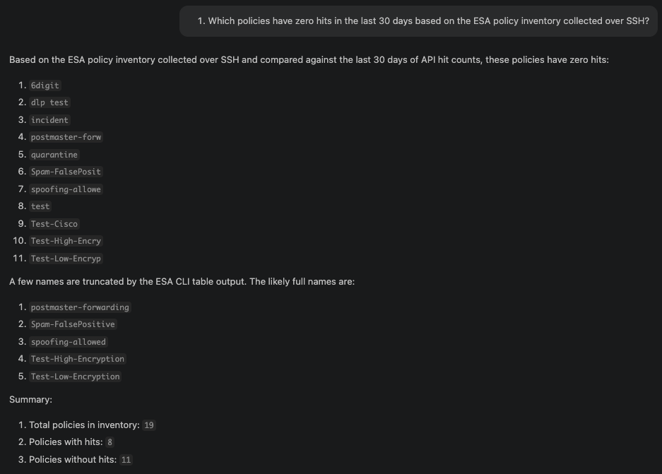
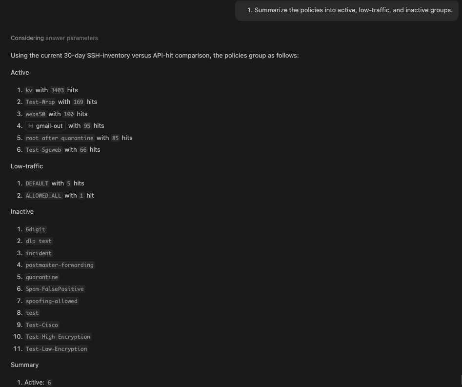
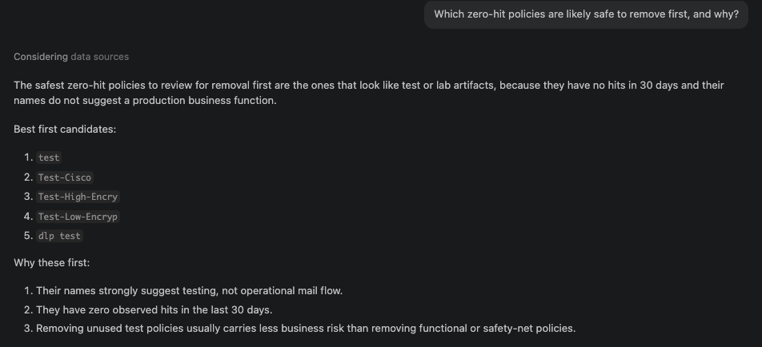
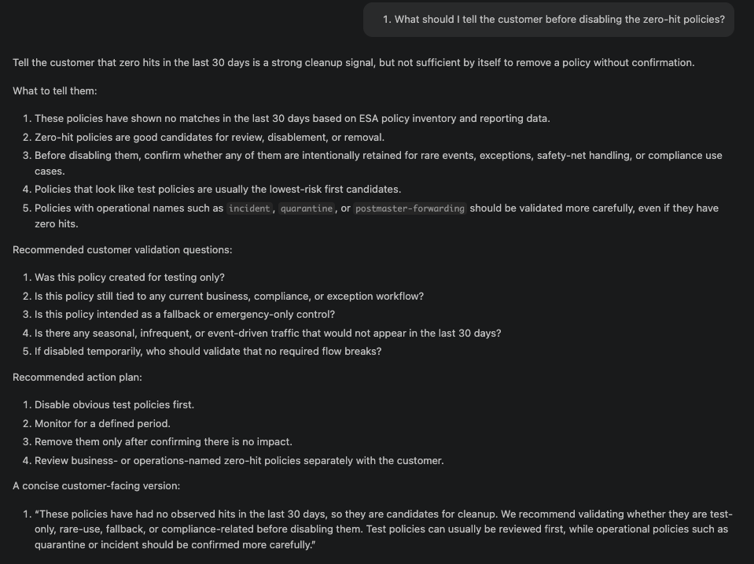
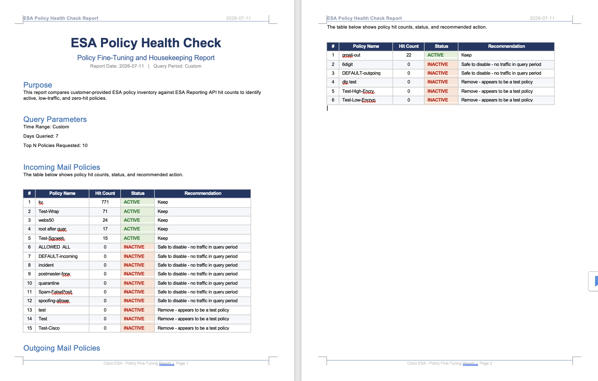

# ESA (CES) Policy Hitcount MCP Server (Stage 2)

Stage 2 provides an MCP-based workflow for ESA policy analysis with AI/NLP conversational investigation.

This Stage 2 workflow supports both ESA and CES deployments.

## ESA and CES Support Notes

- ESA: works natively with standard API access and configuration workflows.
- CES (Cloud Email Security): supported, but CES infrastructure is managed by Cisco CES Operations.
- For CES, customers should open a TAC request to obtain API user access and CES configuration export support.
- For CES policy inventory, SSH-based policy collection (`fetch_via_ssh=true`) is often the easiest and most practical option.
- API user permissions (ESA and CES): use read-only access only. Full admin is not required and is not encouraged due to sensitive credentials.

Stage 1 reference (script-only baseline):
- https://github.com/CiscoDevNet/ESA-Policy-Hitcount
- Stage 1 runs direct scripts to fetch and compare policy hit data, without MCP tool orchestration.

## What Stage 2 Adds

With Stage 2, MCP clients can call tools to:
- Query incoming and outgoing policy hit counts for a selected time window.
- Compare policy inventory (ESA XML config export or SSH `policyconfig`) versus API hit results using Stage 1-equivalent crunching logic.
- Identify zero-hit and low-traffic policies more reliably.
- Ask follow-up investigation questions and get context-aware summaries.
- Optionally export comparison output to JSON and generate a DOCX health report.

Primary server and client:
- `mcp-esa-ces.py`
- `mcp-client.py`

## Stage 2 Tooling Surface

Server exposes these MCP tools:
- `get_policy_hit_count_tool`
  - Inputs: `days_to_query`, `top_n_policies`
  - Returns: incoming/outgoing policy hit lists with counts
- `compare_config_to_hit_counts_tool`
  - Inputs: `config_text` or `config_file_path` (ESA XML config export expected for file input)
  - Optional SSH inventory mode: `fetch_via_ssh`, `ssh_host`, `ssh_user`, `ssh_pass`, `ssh_port`
  - Returns: `policies_with_hits`, `policies_without_hits`, summary counts
- `explain_top_policy_hits_tool`
  - Inputs: `days_to_query`, `top_n_policies`, `compare_with_previous_period`
  - Returns: period-over-period explanation candidates with evidence
- `fetch_esa_config_text_tool`
  - Inputs: `config_api_path`/`config_url`, optional `save_to_file_path`
  - Returns: config text preview and save status

## Prerequisites

- Python 3.11+
- Node.js (for DOCX generation script)
- Network reachability from this host to ESA API/management interfaces
- ESA API credentials with reporting access
- ESA policy inventory source:
  - Preferred: ESA XML config export
  - Alternative: SSH inventory collection from `policyconfig`

Python packages used by server:
- `fastmcp`
- `paramiko`
- `requests`
- `urllib3`

## Quick Start (Stage 2)

1. Create and activate virtual environment

```bash
python3 -m venv env
source env/bin/activate
```

2. Install dependencies

```bash
pip install fastmcp paramiko requests urllib3
npm install
```

3. Configure environment variables

```bash
# A dummy .env is included in this repository.
# Edit .env and set real values before first run.
set -a && source .env && set +a
```

Important:
- The committed `.env` contains dummy values only.
- Update `ESA_IP`, `ESA_API_USER`, and `ESA_API_PASS` before running the server.
- Do not commit real credentials back to source control.

4. Start MCP server

```bash
python3 mcp-esa-ces.py
```

5. Keep server running, then choose one of the usage paths below

Default endpoint:
- `http://127.0.0.1:8080/mcp`

## Stage 2 Usage Paths

### A) Backend Smoke Test (CLI)

Use this path to verify server health and ESA connectivity only.

In another terminal:

```bash
python3 mcp-client.py --mode list-tools
python3 mcp-client.py --mode run --days 1 --top 5
python3 mcp-client.py --mode compare-config --days 30 --top 1000 --config-file /path/to/esa-config.xml
python3 mcp-client.py --mode compare-config --days 30 --top 1000 --config-file /path/to/esa-config.xml --output-json compare-config-output.json
```

### B) AI Conversational Workflow (Primary)

This is the main Stage 2 value.

1. Connect your MCP-capable AI client to `http://127.0.0.1:8080/mcp`.
2. Provide policy inventory as ESA XML config export (or use SSH inventory mode).
3. Ask natural-language questions; AI will call tools and guide the investigation.

Typical Stage 2 AI usage (minimum required):
- Keep the Stage 2 MCP server running.
- Connect your AI client to `http://127.0.0.1:8080/mcp`.
- Provide a policy inventory source for compare workflows:
  - ESA XML config export via file/content input, or
  - SSH inventory mode (`fetch_via_ssh=true`).

Preferred/common way to provide config to AI chat:
- Preferred: upload the ESA XML config export directly in the AI chat, then ask AI to run comparison for your target window.
- Alternative: provide a local XML file path if your AI client can access local files.
- Fallback: use SSH inventory mode (`fetch_via_ssh=true`) when XML export is not available.

If you skip the policy inventory input, hit-count tools still work, but config-vs-hit comparison will be incomplete.

Suggested prompts:
- Which policies have zero hits in the last 30 days based on this ESA XML export?
- Group policies into active, low-traffic, and inactive.
- Which zero-hit policies are safer to disable first, and why?
- Draft customer communication before disabling inactive policies.

## Fire Drill Runbook

Use this runbook to validate Stage 2 end-to-end in less than 10 minutes.

1. Start server

```bash
python3 mcp-esa-ces.py
```

2. Validate MCP tool registration

```bash
python3 mcp-client.py --url http://127.0.0.1:8080/mcp --mode list-tools
```

Expected outcome:
- 4 tools visible: `get_policy_hit_count_tool`, `compare_config_to_hit_counts_tool`, `explain_top_policy_hits_tool`, `fetch_esa_config_text_tool`

3. Validate live hit retrieval

```bash
python3 mcp-client.py --url http://127.0.0.1:8080/mcp --mode run --days 1 --top 5
```

Expected outcome:
- Non-empty JSON-style response with `incoming_policy_hits` and/or `outgoing_policy_hits`

4. Validate compare flow with ESA XML inventory

```bash
python3 mcp-client.py --url http://127.0.0.1:8080/mcp --mode compare-config --days 30 --top 1000 --config-file /path/to/esa-config.xml --output-json compare-config-output.json
```

Expected outcome:
- `compare-config-output.json` created
- Includes active/inactive evidence fields and summary totals

5. Optional report generation

```bash
node generate-health-report.js --input compare-config-output.json --output ESA-Policy-Health-Check.docx
```

Expected outcome:
- DOCX report artifact generated successfully

## Operator Q&A (Canned Prompts)

Use these exact prompts in your MCP-capable AI chat.

1. Inventory and baseline
- What are my policies from this ESA XML export?
- Split them into incoming vs outgoing inventory.

2. Activity analysis
- Which of these are active vs inactive in the last 30 days?
- Show low-traffic policies using a practical threshold and explain the threshold.

3. Actionability
- Show me only inactive policies with recommended cleanup priority.
- Which policies are safer to disable first, and what is the rollback plan?

4. Housekeeping governance
- Build a monthly housekeeping plan for these inactive policies.
- Draft a change-control note and customer communication before disablement.

## Quick Commands (Default Local Endpoint)

All commands below assume the local Stage 2 server endpoint:
- `http://127.0.0.1:8080/mcp`

```bash
# List MCP tools
python3 mcp-client.py --url http://127.0.0.1:8080/mcp --mode list-tools

# Get latest hit-count snapshot
python3 mcp-client.py --url http://127.0.0.1:8080/mcp --mode run --days 1 --top 5

# 30-day view with wider policy coverage
python3 mcp-client.py --url http://127.0.0.1:8080/mcp --mode run --days 30 --top 500 --output-json last30-hits.json

# Compare ESA XML inventory vs 30-day hits
python3 mcp-client.py --url http://127.0.0.1:8080/mcp --mode compare-config --days 30 --top 1000 --config-file /path/to/esa-config.xml --output-json compare-config-output.json
```

## Stage 2 Workflow Details (Both Paths)

This section supports both usage paths above.
If you are using Path B (AI Conversational Workflow), you do not need to run `mcp-client.py` unless you want a manual debug check.

1. Collect policy inventory
- Use ESA XML config export file, or
- Use SSH `policyconfig` collection through MCP tool parameters

2. Run policy comparison for a target window (for example, 30 days)

- AI path (primary): ask your AI client to compare the ESA XML inventory for the target time window.
- CLI path (optional/manual):

```bash
python3 mcp-client.py --mode compare-config --days 30 --top 1000 --config-file /path/to/esa-config.xml --output-json compare-config-output.json
```

Input guidance:
- For `--config-file`, use ESA XML config export.
- Do not use CLI table text dumps (for example, `policyconfig` terminal output) as file input.
- If you only have CLI access, use SSH inventory mode (`fetch_via_ssh=true`) instead.

3. Use MCP/AI Q&A to investigate actionability (primary Stage 2 value)
- Zero-hit policies
- Active vs low-traffic vs inactive grouping
- Safer removal candidates
- Customer messaging before disablement

4. Optional: generate DOCX report artifact

```bash
node generate-health-report.js --input compare-config-output.json --output ESA-Policy-Health-Check.docx
```

## Screenshot Walkthrough (Stage 2 Q&A)

The following screenshots show a practical Stage 2 investigation sequence.

### Q1: Which policies have zero hits in the last 30 days?



Use this to identify initial cleanup candidates and confirm inventory/hit-count coverage.

### Q2: Summarize policies into active, low-traffic, and inactive groups



This gives a fast triage view for operational decisions.

### Q3: Which zero-hit policies are safer to remove first, and why?



This helps prioritize lower-risk candidates (for example, test/lab-like policy names) before business-critical flows.

### Q4: What should be communicated before disabling zero-hit policies?



Use this to frame customer validation checks and staged rollout guidance.

## Optional Report Artifact

DOCX output preview:



## Notes and Caveats

- API hit-count endpoints report observed traffic; they do not independently prove policy intent.
- Zero hits in a period is a strong signal, but not sufficient alone for removal.
- Validate exception, seasonal, fallback, and compliance-related policies before disablement.
- SSH `policyconfig` output may include truncated names; treat name matching carefully in review.

## Security and Publishing Hygiene

Before publishing, remove any hardcoded credentials and move secrets to environment variables.

Recommended `.gitignore` entries:
- `env/`
- `node_modules/`
- `__pycache__/`
- `.DS_Store`
- `*.pyc`
- `*.log`
- Keep only dummy `.env` values in source control; never commit real credentials.
